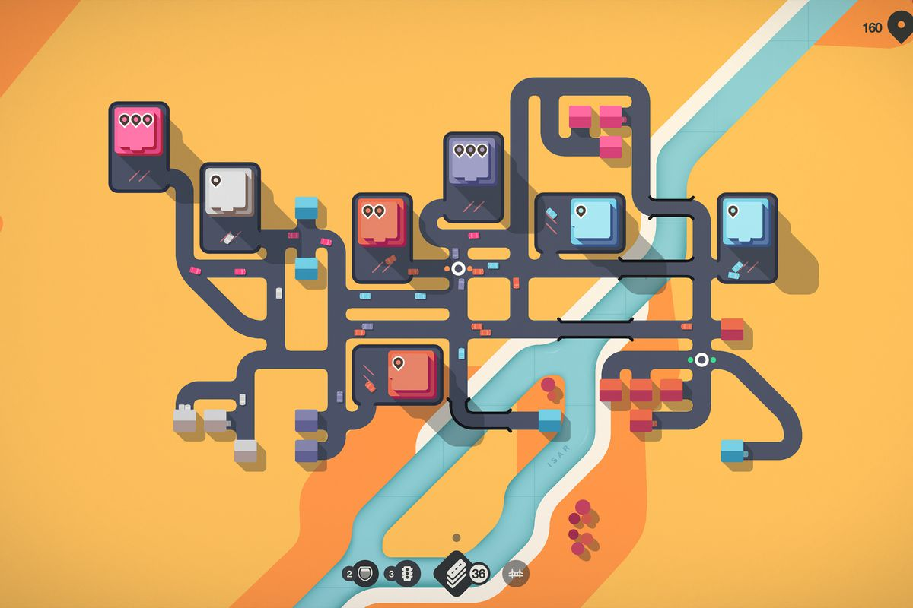

# ywan0375_9103_tut06_majorProject
Creative coding major project, the final assignment of Eric Wang.

# 1 Brief Introduction
In my individual part, I combined Mondrian's interpretation of his work Boogie Woogie to give dynamic and practical meaning to the static abstract blocks he drew. Through user input, the user can interact with the work and reset the work based on time.

# 2 Project Concept
I take the Boogie Woogie as a bird's-eye view of a busy neighborhood. Among them, the yellow horizontal and vertical lines are regarded as roads, and the small squares inside them are regarded as cars. Other blocks of varying sizes are considered as buildings.
The design concept includes the following three points:
1. Make the "cars" move along the "roads".
2. Use user input to place "buildings".
3. Periodically reset the screen and erase the user input.

# 3 Coding Iteration
1. **Reword group code.** Change the generation logic of random small squares, generate them directly in the **setup()** function and save them in the array. Then draw them uniformly in the **draw()** function.
2. **Make the blocks move.** Declare the speed and direction of the block ahead of time in the **randomBlock()** class. In the **draw()** function, the positions and lengths of different yellow lines are first identified, and then the small squares can only move back and forth within the specified range.
3. **User input & Time-based.** When the user presses the mouse, generate a randomly sized box at the mouse location. To avoid confusion, set a scheduled refresh time. A scheduled refresh will erase all user input and return the screen to its original state.

# 4 Key Details
1. **Make the canvas flexible.** Use proportions to determine the size of each segment, rather than absolute values.
2. **CLasses & Arrays.** Divide different blocks into different classes, and then store them in arrays to facilitate unified management.
3. **Divide the canvas using a grid.** In order to avoid canvas clutter, use a certain scale modulus to manage it. Even user-entered squares will land on nearby grid points.

# 5 Inspiration Reference
1. **Mini Motorways**

A puzzle and construction game. The inspiration for the mapping of abstract graphics comes from this.
